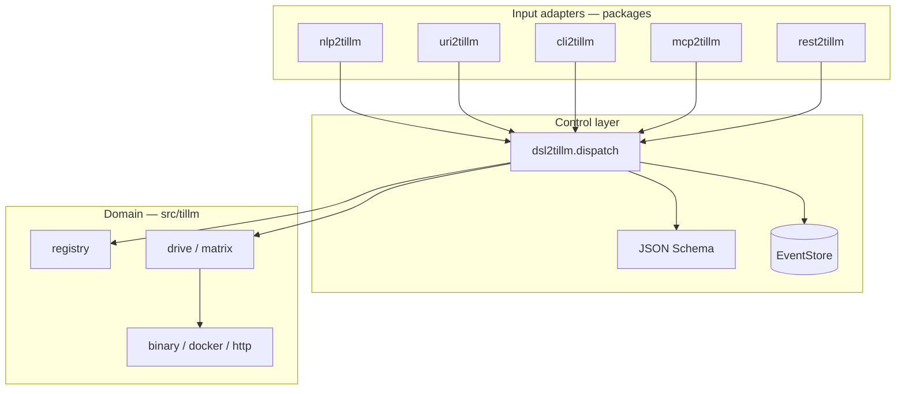

# tillm

**Text-interface LLM control plane** for the semcod/coru ecosystem.

Drives shell and terminal clients (`aider`, `claude`, `codex`, `gemini`, `qwen-code`, `opencode`, `devin`) from one registry and execution pipeline. Pair with [`gillm`](../gillm) for **graphical** control (focus, inject, capture, orchestrator DSL).

  

## AI Cost Tracking

 

This project uses AI-generated code. Total cost: **$11.1812** with **37** AI commits.

Generated on 2026-06-29 using [openrouter/deep/deep-v4-pro](https://openrouter.ai/models/openrouter/deep/deep-v4-pro)

---

| Package | Interface | Role |
| --- | --- | --- |
| **tillm** | text / shell | vendor CLI registry, `drive`, multi-client matrix, transports |
| **gillm** | graphical | GUI domain + `*2gillm` adapters (REST :8220, MCP, …) |

## Contents

- [Architecture](#architecture)
- [Control layer packages](#control-layer-packages)
- [Installation](#installation)
- [Quick start](#quick-start)
- [Shell clients](#shell-clients)
- [Multi-client orchestration](#multi-client-orchestration)
- [Configuration](#configuration)
- [Version and updates](#version-and-updates)
- [Testing](#testing)
- [Documentation](#documentation)
- [License](#license)

## Architecture

```
SUMD (description) → DOQL/source (code) → taskfile (automation) → testql (verification)
```

Sources: [`SUMD.md`](SUMD.md) · [`app.doql.less`](app.doql.less)



## Control layer packages

| Package | Role | Port |
| --- | --- | --- |
| **dsl2tillm** | DSL + JSON Schema + CQRS bus | — |
| **uri2tillm** | `tillm://` → DSL | — |
| **nlp2tillm** | NL → DSL | — |
| **cli2tillm** | Shell REPL | — |
| **mcp2tillm** | MCP stdio | — |
| **rest2tillm** | FastAPI `/v1/dsl` | **8216** |

Details: [docs/control-layer.md](docs/control-layer.md) · [packages/README.md](packages/README.md)

## Installation

### Core (editable dev)

```bash
git clone <repo> tillm && cd tillm
pip install -e ".[dev]"
```

### Control layer (all `*2tillm` packages)

```bash
bash packages/install-dev.sh
```

### Optional ecosystem siblings

```bash
pip install -e ../nlp2dsl ../intract ../redsl ../proxym ../llx   # adjust paths
```

> **Note:** `tillm` and `*2tillm` are not yet published on PyPI. Use editable installs from the repo.

## Quick start

```bash
# List registered shell clients
tillm clients

# Dry-run (plans command, saves prompt, does not execute)
tillm drive --client aider --prompt "Refactor ticket PLF-1"

# Execute (requires client env vars — see configuration)
tillm drive --client aider --prompt "Refactor ticket PLF-1" --execute

# NLP → drive intent
tillm nlp "aider: napraw testy"

# Ecosystem validation
tillm validate

# Control layer
dsl2tillm exec HEALTH
rest2tillm serve --port 8216
```

`tillm drive` always saves the prompt under `.koru/tillm/prompts/` before dry-run or execute.

## Shell clients

Eight clients in the registry. Live status: `tillm clients` (`ok` / `~` / `--`).

| Client | Headless | Automation profile |
| --- | --- | --- |
| claude-code | `claude -p` | `--dangerously-skip-permissions` |
| aider | `--message-file` | — |
| codex | `codex exec` | `--dangerously-bypass-approvals-and-sandbox` |
| gemini-cli | `gemini -p` | `--yolo` |
| qwen-code | `qwen -p` | — |
| opencode | `opencode run` | — |
| devin | `devin -p` | `--permission-mode dangerous` |
| cline | dry-run only | — |

Per-client setup: [docs/clients/](docs/clients/)

## Multi-client orchestration

```bash
tillm drive --clients aider,codex --prompt "review auth" --parallel 2
tillm drive --all --prompt "review" --execute --profile automation
tillm drive --all --prompt "review" --quorum 2 --fail-fast
```

DSL equivalent:

```text
DRIVE_MATRIX CLIENTS aider,codex PROMPT "review" PARALLEL 2
DRIVE_MATRIX ALL PROMPT "review" EXECUTE true PROFILE automation
```

## Configuration

Copy `.env.example` → `.env`. tillm **auto-loads** `<project>/.env` (via `project_env` + optional `env2llm`):

```bash
# .env — tillm reads this automatically from project root
OPENROUTER_API_KEY=sk-or-v1-...
LLM_MODEL=openrouter/deepseek/deepseek-v4-pro
AIDER_MODEL=openrouter/deepseek/deepseek-v4-pro   # optional; defaults from LLM_MODEL

tillm drive --client aider --prompt "fix tests" --execute
```

Install env2llm integration: `pip install -e ".[env]"` or `pip install -e ../env2llm`

Full reference: [docs/configuration.md](docs/configuration.md)

### Environment variables

| Variable | Default | Purpose |
| --- | --- | --- |
| `TILLM_DEFAULT_CLIENT` | `aider` | Default for `tillm nlp` |
| `TILLM_EXECUTE_PROFILE` | `default` | `automation` for CI |
| `TILLM_BACKEND` | `binary` | `docker` for compose exec |
| `TILLM_NLP2DSL` | off | External NLP2DSL bridge |

### Optional NLP2DSL bridge

```bash
export TILLM_NLP2DSL=1
export NLP2DSL_BACKEND_URL=http://localhost:8010
tillm nlp "uruchom claude dla ticketu PLF-123"
```

Without the service, tillm uses a deterministic local parser.

## Version and updates

### Check installed version

```bash
pip show tillm | grep Version          # core: 0.1.32
cat VERSION
pip show dsl2tillm rest2tillm         # control layer: 0.1.0
tillm clients
tillm validate
```

### Update from repo (current workflow)

```bash
cd tillm
git pull
pip install -e ".[dev]"
bash packages/install-dev.sh
python -m pytest tests/test_tillm.py packages/*/tests -q
```

### Update vendor CLIs (independent)

```bash
pip install -U aider-chat
npm update -g @anthropic-ai/claude-code @openai/codex @google/gemini-cli
```

When published to PyPI:

```bash
pip install -U tillm dsl2tillm uri2tillm nlp2tillm cli2tillm mcp2tillm rest2tillm
```

## Testing

```bash
python -m pytest tests/test_tillm.py packages/*/tests -q
dsl2tillm validate-schema
dsl2tillm exec HEALTH
```

## Examples

Runnable smoke tests per shell client (OpenRouter + tillm):

```bash
cp examples/openrouter/env.example .env   # set OPENROUTER_API_KEY
source examples/openrouter/load-env.sh
bash examples/aider/execute.sh
bash examples/run-all-dry-run.sh
```

See [examples/README.md](examples/README.md).

## Documentation

| Document | Description |
| --- | --- |
| [examples/README.md](examples/README.md) | Per-client CLI smoke scripts |
| [docs/README.md](docs/README.md) | Documentation index |
| [docs/configuration.md](docs/configuration.md) | `.env`, OpenRouter, env vars |
| [docs/control-layer.md](docs/control-layer.md) | `*2tillm` packages |
| [docs/clients/](docs/clients/) | Per-client setup |
| [packages/README.md](packages/README.md) | Control layer quick reference |
| [SUMD.md](SUMD.md) | Architecture description |
| [CHANGELOG.md](CHANGELOG.md) | Release history |
| [TODO.md](TODO.md) | Remaining work |

## License

Licensed under Apache-2.0.
