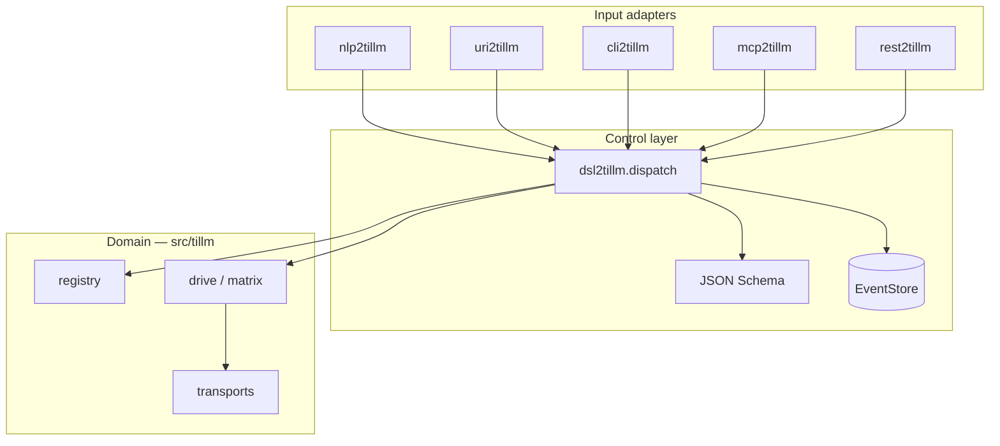

# Control layer (`*2tillm`)

Thin adapters around `dsl2tillm.dispatch()` — same pattern as [`gillm/packages/*2gillm`](../../gillm/packages/).

Domain logic (registry, drive, matrix, transports) stays in `src/tillm/`.

## Packages

| Package | Role | Port |
| --- | --- | --- |
| **dsl2tillm** | DSL + JSON Schema + CQRS bus + EventStore | — |
| **uri2tillm** | `tillm://` → DSL line → `dispatch()` | — |
| **nlp2tillm** | NL → DSL (`to-dsl`); `apply` = dispatch | — |
| **cli2tillm** | Shell REPL / exec / run | — |
| **mcp2tillm** | MCP stdio tools | — |
| **rest2tillm** | FastAPI `/v1/dsl` | **8216** |

## Install (dev)

```bash
bash packages/install-dev.sh
```

## DSL verbs

| Type | Verbs |
| --- | --- |
| Query | `HEALTH`, `CLIENTS`, `ORIENT`, `ACTIONS`, `VALIDATE`, `RESOLVE`, `DOCKER_STATUS` |
| Command | `DRIVE`, `DRIVE_MATRIX` |

Example:

```text
HEALTH
DRIVE CLIENT aider PROMPT "fix tests"
DRIVE CLIENT codex PROMPT "plan" EXECUTE true PROFILE automation
DRIVE_MATRIX CLIENTS aider,codex PROMPT "review" PARALLEL 2
```

## Adapters

```bash
# DSL CLI
dsl2tillm validate-schema
dsl2tillm exec HEALTH

# Shell REPL
cli2tillm shell
cli2tillm exec CLIENTS

# NLP
nlp2tillm to-dsl "aider: fix tests"

# URI
uri2tillm decode --uri "tillm://cmd/HEALTH"
uri2tillm run --uri "tillm://client/aider?prompt=fix%20tests"

# REST (pair with rest2gillm :8220)
rest2tillm serve --port 8216
curl -X POST http://127.0.0.1:8216/v1/dsl -d HEALTH

# MCP
mcp2tillm serve
```

## Architecture



Template reference: [packages/CONTROL_LAYER_PROMPT.template.md](../packages/CONTROL_LAYER_PROMPT.template.md)
