# System Architecture Analysis
<!-- generated in 0.00s -->

## Overview

- **Project**: /home/tom/github/semcod/tillm
- **Primary Language**: python
- **Languages**: python: 39, json: 10, toml: 7, shell: 2, yaml: 2
- **Analysis Mode**: static
- **Total Functions**: 136
- **Total Classes**: 18
- **Modules**: 62
- **Entry Points**: 47

## Architecture by Module

### src.tillm.controller
- **Functions**: 18
- **Classes**: 10
- **File**: `controller.py`

### src.tillm.registry
- **Functions**: 13
- **Classes**: 1
- **File**: `registry.py`

### src.tillm.cli
- **Functions**: 12
- **File**: `cli.py`

### packages.dsl2tillm.src.dsl2tillm.handlers
- **Functions**: 12
- **Classes**: 1
- **File**: `__init__.py`

### src.tillm.compat
- **Functions**: 11
- **File**: `compat.py`

### src.tillm.validation
- **Functions**: 8
- **Classes**: 1
- **File**: `validation.py`

### packages.uri2tillm.src.uri2tillm.uri
- **Functions**: 6
- **File**: `uri.py`

### packages.mcp2tillm.src.mcp2tillm.server
- **Functions**: 6
- **Classes**: 1
- **File**: `server.py`

### packages.dsl2tillm.src.dsl2tillm.grammar
- **Functions**: 5
- **File**: `grammar.py`

### packages.dsl2tillm.src.dsl2tillm.events
- **Functions**: 5
- **Classes**: 2
- **File**: `events.py`

### src.tillm.nlp
- **Functions**: 5
- **Classes**: 1
- **File**: `nlp.py`

### src.tillm.transports.docker
- **Functions**: 5
- **File**: `docker.py`

### packages.dsl2tillm.src.dsl2tillm.schema_registry
- **Functions**: 4
- **File**: `schema_registry.py`

### packages.dsl2tillm.src.dsl2tillm.cli
- **Functions**: 3
- **File**: `cli.py`

### packages.dsl2tillm.src.dsl2tillm.pb_codec
- **Functions**: 3
- **File**: `pb_codec.py`

### packages.dsl2tillm.src.dsl2tillm.codec
- **Functions**: 3
- **File**: `codec.py`

### packages.dsl2tillm.src.dsl2tillm.bus
- **Functions**: 3
- **File**: `bus.py`

### packages.nlp2tillm.src.nlp2tillm.to_dsl
- **Functions**: 2
- **File**: `to_dsl.py`

### project
- **Functions**: 1
- **File**: `project.sh`

### packages.mcp2tillm.src.mcp2tillm.cli
- **Functions**: 1
- **File**: `cli.py`

## Key Entry Points

Main execution flows into the system:

### packages.cli2tillm.src.cli2tillm.cli.main
- **Calls**: argparse.ArgumentParser, parser.add_subparsers, sub.add_parser, shell.add_argument, shell.add_argument, sub.add_parser, run.add_argument, run.add_argument

### packages.dsl2tillm.src.dsl2tillm.grammar.to_text
- **Calls**: None.upper, payload.get, payload.get, payload.get, payload.get, payload.get, None.join, payload.get

### packages.nlp2tillm.src.nlp2tillm.cli.main
- **Calls**: argparse.ArgumentParser, parser.add_subparsers, sub.add_parser, to.add_argument, to.add_argument, sub.add_parser, apply.add_argument, apply.add_argument

### packages.uri2tillm.src.uri2tillm.cli.main
- **Calls**: argparse.ArgumentParser, parser.add_subparsers, sub.add_parser, decode.add_argument, decode.add_argument, sub.add_parser, run.add_argument, run.add_argument

### src.tillm.compat.launch_koru_agent
> Launch a Koru agent through TILLM while preserving TTY behavior.

Clients with a file/arg prompt contract receive the prompt directly.
Stdin-only clie
- **Calls**: src.tillm.registry.normalize_client_id, src.tillm.registry.get_client_spec, src.tillm.controller.save_prompt, print, print, print, ShellDriveRequest, src.tillm.controller.build_drive_plan

### packages.mcp2tillm.src.mcp2tillm.server.TillmMCPServer._register_tools
- **Calls**: self.app.tool, self.app.tool, self.app.tool, self.app.tool, self.app.tool, self.app.tool, None.to_dict, packages.dsl2tillm.src.dsl2tillm.bus.dispatch

### packages.dsl2tillm.src.dsl2tillm.events.EventStore.read_all
- **Calls**: None.splitlines, self.path.is_file, json.loads, events.append, self.path.read_text, line.strip, StoredEvent, str

### src.tillm.registry.ShellClientSpec.to_dict
- **Calls**: self.command_path, self.missing_env_vars, list, list, list, list, list, list

### src.tillm.cli.main
- **Calls**: None.parse_args, AssertionError, src.tillm.cli._normalize_extra_arg_tokens, src.tillm.cli._print, src.tillm.cli._drive, src.tillm.cli._nlp, src.tillm.cli._print, src.tillm.cli._build_parser

### src.tillm.compat.detect_koru_agent_rows
> Return SLLM clients in Koru ``AgentOption.to_dict`` shape.
- **Calls**: src.tillm.registry.detect_clients, row.get, str, bool, rows.append, row.get, bool, bool

### packages.dsl2tillm.src.dsl2tillm.events.EventStore.append_command
- **Calls**: StoredEvent, self.path.parent.mkdir, uuid.uuid4, self.path.open, fh.write, int, time.time, json.dumps

### packages.rest2tillm.src.rest2tillm.cli.main
- **Calls**: argparse.ArgumentParser, parser.add_subparsers, sub.add_parser, serve.add_argument, serve.add_argument, parser.parse_args, uvicorn.run, packages.rest2tillm.src.rest2tillm.app.create_app

### src.tillm.registry.ShellClientSpec.missing_env_vars
- **Calls**: tuple, missing.append, any, None.join, None.strip, None.strip, env.get, env.get

### packages.uri2tillm.src.uri2tillm.uri.uri_for_client
- **Calls**: query_parts.append, query_parts.append, packages.uri2tillm.src.uri2tillm.uri._encode, None.join, packages.uri2tillm.src.uri2tillm.uri._encode, packages.uri2tillm.src.uri2tillm.uri._encode

### src.tillm.compat.tool_registry_entries
- **Calls**: src.tillm.registry.iter_client_specs, tuple, entries.append, list, list, list

### packages.mcp2tillm.src.mcp2tillm.cli.main
- **Calls**: argparse.ArgumentParser, parser.add_subparsers, sub.add_parser, parser.parse_args, packages.mcp2tillm.src.mcp2tillm.server.run_server

### packages.uri2tillm.src.uri2tillm.uri.uri_for_cmd
- **Calls**: None.join, packages.uri2tillm.src.uri2tillm.uri._encode, params.items, verb.upper, packages.uri2tillm.src.uri2tillm.uri._encode

### packages.dsl2tillm.src.dsl2tillm.events.EventStore.for_workdir
- **Calls**: None.resolve, events_dir.mkdir, cls, workdir.expanduser

### src.tillm.controller.ShellDrivePlan.to_dict
- **Calls**: list, self.shell_preview, str, str

### src.tillm.controller._drive_one_client
- **Calls**: ShellDriveRequest, src.tillm.controller.drive_shell_llm, src.tillm.controller.resolve_backend, src.tillm.controller._drive_result_from_exception

### packages.dsl2tillm.src.dsl2tillm.cli.main
- **Calls**: list, packages.dsl2tillm.src.dsl2tillm.cli._main_legacy, packages.dsl2tillm.src.dsl2tillm.cli._main_subcommand

### packages.dsl2tillm.src.dsl2tillm.schema_registry.all_verbs
- **Calls**: sorted, None.keys, packages.dsl2tillm.src.dsl2tillm.schema_registry._load_schemas

### src.tillm.compat.is_client_available
- **Calls**: src.tillm.registry.get_client_spec, bool, spec.command_path

### src.tillm.compat.drive_koru_chat
- **Calls**: src.tillm.controller.drive_shell_llm, result.to_dict, ShellDriveRequest

### packages.mcp2tillm.src.mcp2tillm.server.TillmMCPServer.__post_init__
- **Calls**: packages.mcp2tillm.src.mcp2tillm.server._require_fastmcp, FastMCP, self._register_tools

### src.tillm.registry.ShellClientSpec.profile_execute_args
- **Calls**: None.lower, ValueError, None.strip

### packages.dsl2tillm.src.dsl2tillm.pb_codec.encode_protobuf
- **Calls**: None.encode, json.dumps

### packages.uri2tillm.src.uri2tillm.uri.is_tillm_uri
- **Calls**: None.scheme.lower, urlparse

### src.tillm.compat.shell_client_ids
- **Calls**: tuple, src.tillm.registry.iter_client_specs

### src.tillm.compat.shell_process_patterns
- **Calls**: tuple, src.tillm.registry.iter_client_specs

## Process Flows

Key execution flows identified:

### Flow 1: main
```
main [packages.cli2tillm.src.cli2tillm.cli]
```

### Flow 2: to_text
```
to_text [packages.dsl2tillm.src.dsl2tillm.grammar]
```

### Flow 3: launch_koru_agent
```
launch_koru_agent [src.tillm.compat]
  └─ →> normalize_client_id
  └─ →> get_client_spec
      └─> normalize_client_id
  └─ →> save_prompt
      └─> _prompt_root
```

### Flow 4: _register_tools
```
_register_tools [packages.mcp2tillm.src.mcp2tillm.server.TillmMCPServer]
```

### Flow 5: read_all
```
read_all [packages.dsl2tillm.src.dsl2tillm.events.EventStore]
```

### Flow 6: to_dict
```
to_dict [src.tillm.registry.ShellClientSpec]
```

### Flow 7: detect_koru_agent_rows
```
detect_koru_agent_rows [src.tillm.compat]
  └─ →> detect_clients
      └─> normalize_client_id
```

### Flow 8: append_command
```
append_command [packages.dsl2tillm.src.dsl2tillm.events.EventStore]
```

### Flow 9: missing_env_vars
```
missing_env_vars [src.tillm.registry.ShellClientSpec]
```

### Flow 10: uri_for_client
```
uri_for_client [packages.uri2tillm.src.uri2tillm.uri]
  └─> _encode
  └─> _encode
```

## Key Classes

### src.tillm.registry.ShellClientSpec
- **Methods**: 5
- **Key Methods**: src.tillm.registry.ShellClientSpec.command_path, src.tillm.registry.ShellClientSpec.profile_execute_args, src.tillm.registry.ShellClientSpec.supported_execute_profiles, src.tillm.registry.ShellClientSpec.missing_env_vars, src.tillm.registry.ShellClientSpec.to_dict

### packages.dsl2tillm.src.dsl2tillm.events.EventStore
- **Methods**: 4
- **Key Methods**: packages.dsl2tillm.src.dsl2tillm.events.EventStore.__init__, packages.dsl2tillm.src.dsl2tillm.events.EventStore.for_workdir, packages.dsl2tillm.src.dsl2tillm.events.EventStore.append_command, packages.dsl2tillm.src.dsl2tillm.events.EventStore.read_all

### packages.mcp2tillm.src.mcp2tillm.server.TillmMCPServer
- **Methods**: 3
- **Key Methods**: packages.mcp2tillm.src.mcp2tillm.server.TillmMCPServer.__post_init__, packages.mcp2tillm.src.mcp2tillm.server.TillmMCPServer._register_tools, packages.mcp2tillm.src.mcp2tillm.server.TillmMCPServer.run

### src.tillm.controller.ShellDrivePlan
- **Methods**: 2
- **Key Methods**: src.tillm.controller.ShellDrivePlan.shell_preview, src.tillm.controller.ShellDrivePlan.to_dict

### packages.dsl2tillm.src.dsl2tillm.result.DslResult
- **Methods**: 1
- **Key Methods**: packages.dsl2tillm.src.dsl2tillm.result.DslResult.to_dict

### packages.dsl2tillm.src.dsl2tillm.events.StoredEvent
- **Methods**: 1
- **Key Methods**: packages.dsl2tillm.src.dsl2tillm.events.StoredEvent.to_dict

### packages.dsl2tillm.src.dsl2tillm.handlers.HandlerResult
- **Methods**: 1
- **Key Methods**: packages.dsl2tillm.src.dsl2tillm.handlers.HandlerResult.to_dict

### src.tillm.nlp.ShellIntent
- **Methods**: 1
- **Key Methods**: src.tillm.nlp.ShellIntent.to_dsl

### src.tillm.validation.ValidationResult
- **Methods**: 1
- **Key Methods**: src.tillm.validation.ValidationResult.to_dict

### src.tillm.controller.ShellDriveResult
- **Methods**: 1
- **Key Methods**: src.tillm.controller.ShellDriveResult.to_dict

### src.tillm.controller.MultiShellDriveResult
- **Methods**: 1
- **Key Methods**: src.tillm.controller.MultiShellDriveResult.to_dict

### src.tillm.controller.TillmError
> Base error for SLLM control failures.
- **Methods**: 0
- **Inherits**: RuntimeError

### src.tillm.controller.UnknownClientError
> Requested client is not registered.
- **Methods**: 0
- **Inherits**: TillmError

### src.tillm.controller.ClientUnavailableError
> Registered client command is not available in PATH.
- **Methods**: 0
- **Inherits**: TillmError

### src.tillm.controller.ClientNotReadyError
> Registered client is missing binary, env vars, or requested capability.
- **Methods**: 0
- **Inherits**: TillmError

### src.tillm.controller.UnknownProfileError
> Requested execute profile is not registered for the client.
- **Methods**: 0
- **Inherits**: TillmError

### src.tillm.controller.ShellDriveRequest
- **Methods**: 0

### src.tillm.controller.MultiShellDriveRequest
- **Methods**: 0

## Data Transformation Functions

Key functions that process and transform data:

### packages.dsl2tillm.src.dsl2tillm.pb_codec.encode_protobuf
- **Output to**: None.encode, json.dumps

### packages.dsl2tillm.src.dsl2tillm.pb_codec.decode_protobuf
- **Output to**: json.loads, dict, data.decode, ValueError, isinstance

### packages.dsl2tillm.src.dsl2tillm.pb_codec.encode_result_protobuf
- **Output to**: None.encode, json.dumps, result.to_dict

### packages.dsl2tillm.src.dsl2tillm.codec.validate_payload
- **Output to**: None.upper, packages.dsl2tillm.src.dsl2tillm.schema_registry.schema_for_verb, jsonschema.validate, ValueError, str

### packages.dsl2tillm.src.dsl2tillm.codec.parse_text
- **Output to**: packages.dsl2tillm.src.dsl2tillm.grammar.parse_line, packages.dsl2tillm.src.dsl2tillm.codec.validate_payload

### packages.dsl2tillm.src.dsl2tillm.schema_registry.validate_schemas
- **Output to**: None.items, sorted, None.get, packages.dsl2tillm.src.dsl2tillm.schema_registry._load_schemas, errors.append

### packages.dsl2tillm.src.dsl2tillm.grammar.parse_line
- **Output to**: line.strip, shlex.split, None.upper, line.startswith, packages.dsl2tillm.src.dsl2tillm.grammar._flag

### packages.uri2tillm.src.uri2tillm.uri._encode
- **Output to**: quote

### packages.uri2tillm.src.uri2tillm.uri._decode
- **Output to**: unquote

### packages.uri2tillm.src.uri2tillm.uri.parse_tillm_uri
- **Output to**: urlparse, packages.uri2tillm.src.uri2tillm.uri._decode, ValueError, packages.uri2tillm.src.uri2tillm.uri._decode, packages.uri2tillm.src.uri2tillm.uri._decode

### src.tillm.cli._format_client_row
- **Output to**: row.get, row.get, row.get, row.get, row.get

### src.tillm.cli._format_matrix_row
- **Output to**: result.get, str, result.get, str, len

### src.tillm.cli._build_parser
- **Output to**: argparse.ArgumentParser, parser.add_subparsers, sub.add_parser, clients.add_argument, sub.add_parser

### src.tillm.compat.shell_process_patterns
- **Output to**: tuple, src.tillm.registry.iter_client_specs

### packages.dsl2tillm.src.dsl2tillm.handlers._validate
- **Output to**: payload.get, src.tillm.validation.ecosystem_status, HandlerResult, src.tillm.validation.validate_client_readiness, result.to_dict

### src.tillm.validation.validate_client_readiness
- **Output to**: src.tillm.registry.get_client_spec, spec.missing_env_vars, ValidationResult, ValidationResult, spec.command_path

### src.tillm.validation.validate_intent
- **Output to**: src.tillm.registry.get_client_spec, ValidationResult, errors.append, errors.extend, intent.prompt.strip

### src.tillm.validation.validate_raw_dsl
- **Output to**: raw_dsl.get, isinstance, str, str, src.tillm.registry.normalize_client_id

### src.tillm.validation.validate_intent_contracts
- **Output to**: parse_contract_line, list, errors.append, parsed.append, list

### src.tillm.controller._validate_request
- **Output to**: ClientNotReadyError, src.tillm.validation.validate_client_readiness, ClientNotReadyError, None.join

## Public API Surface

Functions exposed as public API (no underscore prefix):

- `packages.rest2tillm.src.rest2tillm.app.create_app` - 34 calls
- `packages.cli2tillm.src.cli2tillm.cli.main` - 32 calls
- `packages.dsl2tillm.src.dsl2tillm.grammar.parse_line` - 29 calls
- `packages.dsl2tillm.src.dsl2tillm.bus.dispatch` - 29 calls
- `packages.uri2tillm.src.uri2tillm.decode.uri_to_dsl` - 27 calls
- `packages.dsl2tillm.src.dsl2tillm.grammar.to_text` - 27 calls
- `src.tillm.controller.drive_shell_llm_many` - 25 calls
- `packages.nlp2tillm.src.nlp2tillm.cli.main` - 20 calls
- `packages.uri2tillm.src.uri2tillm.cli.main` - 17 calls
- `src.tillm.compat.launch_koru_agent` - 17 calls
- `src.tillm.registry.resolve_client_ids` - 17 calls
- `src.tillm.validation.validate_raw_dsl` - 16 calls
- `src.tillm.controller.build_drive_plan` - 15 calls
- `packages.dsl2tillm.src.dsl2tillm.events.EventStore.read_all` - 13 calls
- `src.tillm.registry.ShellClientSpec.to_dict` - 12 calls
- `packages.cli2tillm.src.cli2tillm.shell.run_shell` - 11 calls
- `src.tillm.cli.main` - 11 calls
- `src.tillm.validation.validate_client_readiness` - 11 calls
- `packages.dsl2tillm.src.dsl2tillm.handlers.run_query` - 10 calls
- `src.tillm.validation.validate_intent` - 10 calls
- `src.tillm.validation.ecosystem_status` - 10 calls
- `src.tillm.transports.docker.docker_service_status` - 10 calls
- `src.tillm.transports.docker.run_docker_drive` - 10 calls
- `packages.dsl2tillm.src.dsl2tillm.schema_registry.validate_schemas` - 9 calls
- `packages.uri2tillm.src.uri2tillm.uri.parse_tillm_uri` - 9 calls
- `src.tillm.transports.binary.run_binary_drive` - 9 calls
- `src.tillm.compat.detect_koru_agent_rows` - 9 calls
- `packages.dsl2tillm.src.dsl2tillm.events.EventStore.append_command` - 9 calls
- `packages.rest2tillm.src.rest2tillm.cli.main` - 8 calls
- `src.tillm.registry.ShellClientSpec.missing_env_vars` - 8 calls
- `src.tillm.controller.save_prompt` - 7 calls
- `packages.dsl2tillm.src.dsl2tillm.codec.validate_payload` - 6 calls
- `packages.uri2tillm.src.uri2tillm.uri.uri_for_client` - 6 calls
- `src.tillm.compat.tool_registry_entries` - 6 calls
- `packages.dsl2tillm.src.dsl2tillm.bus.execute_dsl` - 6 calls
- `src.tillm.validation.validate_intent_contracts` - 6 calls
- `packages.mcp2tillm.src.mcp2tillm.cli.main` - 5 calls
- `packages.dsl2tillm.src.dsl2tillm.pb_codec.decode_protobuf` - 5 calls
- `packages.uri2tillm.src.uri2tillm.uri.uri_for_cmd` - 5 calls
- `packages.dsl2tillm.src.dsl2tillm.handlers.run_command` - 5 calls

## System Interactions

How components interact:

```mermaid
graph TD
    main --> ArgumentParser
    main --> add_subparsers
    main --> add_parser
    main --> add_argument
    to_text --> upper
    to_text --> get
    launch_koru_agent --> normalize_client_id
    launch_koru_agent --> get_client_spec
    launch_koru_agent --> save_prompt
    launch_koru_agent --> print
    _register_tools --> tool
    read_all --> splitlines
    read_all --> is_file
    read_all --> loads
    read_all --> append
    read_all --> read_text
    to_dict --> command_path
    to_dict --> missing_env_vars
    to_dict --> list
    main --> parse_args
    main --> AssertionError
    main --> _normalize_extra_arg
    main --> _print
    main --> _drive
    detect_koru_agent_ro --> detect_clients
    detect_koru_agent_ro --> get
    detect_koru_agent_ro --> str
    detect_koru_agent_ro --> bool
    detect_koru_agent_ro --> append
    append_command --> StoredEvent
```



## Reverse Engineering Guidelines

1. **Entry Points**: Start analysis from the entry points listed above
2. **Core Logic**: Focus on classes with many methods
3. **Data Flow**: Follow data transformation functions
4. **Process Flows**: Use the flow diagrams for execution paths
5. **API Surface**: Public API functions reveal the interface

## Context for LLM

Maintain the identified architectural patterns and public API surface when suggesting changes.