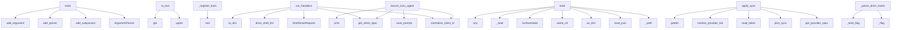

# System Architecture Analysis
<!-- generated in 0.00s -->

## Overview

- **Project**: /home/tom/github/autogrammar/tillm
- **Primary Language**: python
- **Languages**: python: 63, shell: 28, json: 10, txt: 7, toml: 7
- **Analysis Mode**: static
- **Total Functions**: 264
- **Total Classes**: 32
- **Modules**: 122
- **Entry Points**: 94

## Architecture by Module

### src.tillm.surfaces_terminal
- **Functions**: 18
- **Classes**: 3
- **File**: `surfaces_terminal.py`

### src.tillm.registry
- **Functions**: 14
- **Classes**: 1
- **File**: `registry.py`

### src.tillm.cli
- **Functions**: 13
- **File**: `cli.py`

### packages.dsl2tillm.src.dsl2tillm.handlers
- **Functions**: 12
- **Classes**: 1
- **File**: `__init__.py`

### src.tillm.providers_store
- **Functions**: 11
- **File**: `providers_store.py`

### packages.mcp2tillm.src.mcp2tillm.server
- **Functions**: 11
- **Classes**: 1
- **File**: `server.py`

### src.tillm.compat
- **Functions**: 11
- **File**: `compat.py`

### src.tillm.surfaces_gui
- **Functions**: 10
- **Classes**: 2
- **File**: `surfaces_gui.py`

### src.tillm.controller_plan
- **Functions**: 10
- **File**: `controller_plan.py`

### packages.dsl2tillm.src.dsl2tillm.grammar
- **Functions**: 8
- **File**: `grammar.py`

### src.tillm.i18n
- **Functions**: 8
- **File**: `i18n.py`

### src.tillm.project_env
- **Functions**: 8
- **File**: `project_env.py`

### src.tillm.cli_output
- **Functions**: 8
- **File**: `cli_output.py`

### src.tillm.providers_drive
- **Functions**: 8
- **File**: `providers_drive.py`

### src.tillm.validation
- **Functions**: 8
- **Classes**: 1
- **File**: `validation.py`

### src.tillm.providers_probe
- **Functions**: 7
- **File**: `providers_probe.py`

### packages.uri2tillm.src.uri2tillm.uri
- **Functions**: 6
- **File**: `uri.py`

### src.tillm.controller_drive
- **Functions**: 6
- **File**: `controller_drive.py`

### packages.dsl2tillm.src.dsl2tillm.events
- **Functions**: 5
- **Classes**: 2
- **File**: `events.py`

### src.tillm.surfaces_io
- **Functions**: 5
- **File**: `surfaces_io.py`

## Key Entry Points

Main execution flows into the system:

### packages.cli2tillm.src.cli2tillm.cli.main
- **Calls**: argparse.ArgumentParser, parser.add_subparsers, sub.add_parser, shell.add_argument, shell.add_argument, sub.add_parser, run.add_argument, run.add_argument

### packages.dsl2tillm.src.dsl2tillm.grammar.to_text
- **Calls**: None.upper, payload.get, payload.get, payload.get, payload.get, payload.get, None.join, payload.get

### packages.mcp2tillm.src.mcp2tillm.server.TillmMCPServer._register_tools
- **Calls**: self.app.tool, self.app.tool, self.app.tool, self.app.tool, self.app.tool, self.app.tool, packages.mcp2tillm.src.mcp2tillm.server._guard_command, None.to_dict

### src.tillm.headless.run_headless
> Run ``prompt`` through ``client_id`` headless and return the result.

``profile='automation'`` uses the client's unattended profile (e.g. ``claude -p

- **Calls**: src.tillm.registry.normalize_client_id, src.tillm.registry.get_client_spec, ShellDriveRequest, src.tillm.controller.drive_shell_llm, result.to_dict, src.tillm.headless.supports_headless, d.get, d.get

### packages.nlp2tillm.src.nlp2tillm.cli.main
- **Calls**: argparse.ArgumentParser, parser.add_subparsers, sub.add_parser, to.add_argument, to.add_argument, sub.add_parser, apply.add_argument, apply.add_argument

### packages.uri2tillm.src.uri2tillm.cli.main
- **Calls**: argparse.ArgumentParser, parser.add_subparsers, sub.add_parser, decode.add_argument, decode.add_argument, sub.add_parser, run.add_argument, run.add_argument

### src.tillm.surfaces_terminal.ClaudeSettingsSurface.read
- **Calls**: self._path, src.tillm.surfaces_io.read_json, src.tillm.surfaces_io.as_dict, src.tillm.surfaces_io.same_url, SurfaceState, data.get, env.get, None.strip

### src.tillm.surfaces_terminal.CodexConfigSurface.read
- **Calls**: self._path, self._load, src.tillm.surfaces_io.as_dict, any, SurfaceState, data.get, path.exists, bool

### src.tillm.compat.launch_koru_agent
> Launch a Koru agent through TILLM while preserving TTY behavior.

Clients with a file/arg prompt contract receive the prompt directly.
Stdin-only clie
- **Calls**: src.tillm.registry.normalize_client_id, src.tillm.registry.get_client_spec, src.tillm.controller_plan.save_prompt, print, print, print, ShellDriveRequest, src.tillm.controller_plan.build_drive_plan

### src.tillm.surfaces_sync.apply_sync
- **Calls**: src.tillm.providers_registry.get_provider_spec, src.tillm.surfaces_sync.plan_sync, None.read_token, src.tillm.providers_store.resolve_provider_token, getattr, src.tillm.surfaces_terminal.ClaudeSettingsSurface.write, results.append, None.to_dict

### packages.dsl2tillm.src.dsl2tillm.grammar._parse_drive_matrix
- **Calls**: packages.dsl2tillm.src.dsl2tillm.grammar._flag, packages.dsl2tillm.src.dsl2tillm.grammar._flag, packages.dsl2tillm.src.dsl2tillm.grammar._bool_flag, packages.dsl2tillm.src.dsl2tillm.grammar._bool_flag, packages.dsl2tillm.src.dsl2tillm.grammar._flag, packages.dsl2tillm.src.dsl2tillm.grammar._flag, packages.dsl2tillm.src.dsl2tillm.grammar._bool_flag, packages.dsl2tillm.src.dsl2tillm.grammar._flag

### src.tillm.cli.main
- **Calls**: None.parse_args, src.tillm.project_env.bootstrap_project_env, AssertionError, src.tillm.cli_parser._normalize_extra_arg_tokens, getattr, src.tillm.cli_output._print, src.tillm.cli._drive, src.tillm.cli._providers_list

### src.tillm.surfaces_terminal.OpencodeConfigSurface.write
- **Calls**: self._path, src.tillm.surfaces_io.read_json, src.tillm.surfaces_io.as_dict, src.tillm.surfaces_io.provider_slug, src.tillm.surfaces_io.as_dict, src.tillm.surfaces_io.as_dict, options.update, src.tillm.surfaces_io.write_private_json

### src.tillm.registry.ShellClientSpec.to_dict
- **Calls**: self.command_path, self.missing_env_vars, list, list, list, list, list, list

### packages.dsl2tillm.src.dsl2tillm.events.TillmEventStore.read_all
- **Calls**: None.splitlines, self.path.is_file, json.loads, events.append, self.path.read_text, line.strip, StoredEvent, str

### src.tillm.surfaces_terminal.OpencodeConfigSurface.read
- **Calls**: self._path, self._entry, src.tillm.surfaces_io.as_dict, SurfaceState, entry.get, path.exists, bool, bool

### src.tillm.surfaces_gui.JetBrainsOpenAILikeSurface.read
- **Calls**: self._paths, reversed, SurfaceState, tree.iter, ET.parse, bool, bool, src.tillm.surfaces_io.same_url

### src.tillm.surfaces_terminal.OpencodeConfigSurface._entry
- **Calls**: src.tillm.surfaces_io.as_dict, providers.values, None.get, src.tillm.surfaces_io.as_dict, src.tillm.surfaces_io.same_url, isinstance, entry.get, options.get

### packages.dsl2tillm.src.dsl2tillm.events.TillmEventStore.append_command
- **Calls**: StoredEvent, self.path.parent.mkdir, uuid.uuid4, self.path.open, fh.write, int, time.time, json.dumps

### src.tillm.surfaces_gui.QoderSurface.read
- **Calls**: self._paths, self._markers, reversed, SurfaceState, self._configured_text, any, bool, bool

### src.tillm.surfaces_terminal.ClaudeSettingsSurface.read_token
- **Calls**: src.tillm.surfaces_io.as_dict, src.tillm.surfaces_io.same_url, None.get, env.get, None.strip, src.tillm.surfaces_io.read_json, self._path, str

### src.tillm.compat.detect_koru_agent_rows
> Return TILLM clients in Koru ``AgentOption.to_dict`` shape.
- **Calls**: src.tillm.registry.detect_clients, row.get, str, bool, rows.append, row.get, bool, bool

### src.tillm.registry.ShellClientSpec.missing_env_vars
- **Calls**: tuple, missing.append, self.has_auth_file, any, None.join, None.strip, None.strip, env.get

### packages.dsl2tillm.src.dsl2tillm.grammar._parse_drive
- **Calls**: packages.dsl2tillm.src.dsl2tillm.grammar._flag, packages.dsl2tillm.src.dsl2tillm.grammar._bool_flag, packages.dsl2tillm.src.dsl2tillm.grammar._bool_flag, packages.dsl2tillm.src.dsl2tillm.grammar._flag, packages.dsl2tillm.src.dsl2tillm.grammar._flag, packages.dsl2tillm.src.dsl2tillm.grammar._flag, packages.dsl2tillm.src.dsl2tillm.grammar._quoted_or_tail, packages.dsl2tillm.src.dsl2tillm.grammar._flag

### src.tillm.surfaces_gui.QoderSurface._markers
- **Calls**: tuple, spec.id.lower, markers.append, alias.lower, None.lower, len, None.split, url.split

### packages.rest2tillm.src.rest2tillm.cli.main
- **Calls**: argparse.ArgumentParser, parser.add_subparsers, sub.add_parser, serve.add_argument, serve.add_argument, parser.parse_args, uvicorn.run, packages.rest2tillm.src.rest2tillm.app.create_app

### src.tillm.surfaces_gui.QoderSurface._configured_text
- **Calls**: tree.iter, None.lower, ET.parse, parts.append, option.get, None.join, option.get

### src.tillm.surfaces_terminal.CodexConfigSurface.write
- **Calls**: self._path, src.tillm.surfaces_io.provider_slug, path.parent.mkdir, path.write_text, self.read, path.exists, path.read_text

### src.tillm.surfaces_terminal.OpencodeConfigSurface.read_token
- **Calls**: src.tillm.surfaces_io.as_dict, None.strip, None.get, str, self._entry, token.startswith, options.get

### packages.uri2tillm.src.uri2tillm.uri.uri_for_client
- **Calls**: query_parts.append, query_parts.append, packages.uri2tillm.src.uri2tillm.uri._encode, None.join, packages.uri2tillm.src.uri2tillm.uri._encode, packages.uri2tillm.src.uri2tillm.uri._encode

## Process Flows

Key execution flows identified:

### Flow 1: main
```
main [packages.cli2tillm.src.cli2tillm.cli]
```

### Flow 2: to_text
```
to_text [packages.dsl2tillm.src.dsl2tillm.grammar]
```

### Flow 3: _register_tools
```
_register_tools [packages.mcp2tillm.src.mcp2tillm.server.TillmMCPServer]
```

### Flow 4: run_headless
```
run_headless [src.tillm.headless]
  └─ →> normalize_client_id
  └─ →> get_client_spec
      └─> normalize_client_id
  └─ →> drive_shell_llm
      └─ →> resolve_provider_drive_attempts
          └─> resolve_request_provider
          └─ →> is_subscription_order_token
```

### Flow 5: read
```
read [src.tillm.surfaces_terminal.ClaudeSettingsSurface]
  └─ →> read_json
  └─ →> as_dict
```

### Flow 6: launch_koru_agent
```
launch_koru_agent [src.tillm.compat]
  └─ →> normalize_client_id
  └─ →> get_client_spec
      └─> normalize_client_id
  └─ →> save_prompt
      └─> _prompt_root
```

### Flow 7: apply_sync
```
apply_sync [src.tillm.surfaces_sync]
  └─> plan_sync
      └─ →> get_provider_spec
          └─> normalize_provider_id
      └─ →> resolve_provider_token
  └─ →> get_provider_spec
      └─> normalize_provider_id
  └─ →> resolve_provider_token
      └─ →> get_provider_spec
          └─> normalize_provider_id
```

### Flow 8: _parse_drive_matrix
```
_parse_drive_matrix [packages.dsl2tillm.src.dsl2tillm.grammar]
  └─> _flag
  └─> _flag
```

### Flow 9: write
```
write [src.tillm.surfaces_terminal.OpencodeConfigSurface]
  └─ →> read_json
  └─ →> as_dict
```

### Flow 10: to_dict
```
to_dict [src.tillm.registry.ShellClientSpec]
```

## Key Classes

### src.tillm.surfaces_terminal.OpencodeConfigSurface
> opencode JSON config with custom provider entry.
- **Methods**: 7
- **Key Methods**: src.tillm.surfaces_terminal.OpencodeConfigSurface._candidates, src.tillm.surfaces_terminal.OpencodeConfigSurface._path, src.tillm.surfaces_terminal.OpencodeConfigSurface.applicable, src.tillm.surfaces_terminal.OpencodeConfigSurface._entry, src.tillm.surfaces_terminal.OpencodeConfigSurface.read, src.tillm.surfaces_terminal.OpencodeConfigSurface.read_token, src.tillm.surfaces_terminal.OpencodeConfigSurface.write

### src.tillm.surfaces_gui.QoderSurface
> Qoder (JetBrains plugin) BYOK settings — detect-only.
- **Methods**: 6
- **Key Methods**: src.tillm.surfaces_gui.QoderSurface._paths, src.tillm.surfaces_gui.QoderSurface.applicable, src.tillm.surfaces_gui.QoderSurface._markers, src.tillm.surfaces_gui.QoderSurface.read, src.tillm.surfaces_gui.QoderSurface._configured_text, src.tillm.surfaces_gui.QoderSurface.read_token

### src.tillm.surfaces_terminal.CodexConfigSurface
> ``~/.codex/config.toml`` model_providers table.
- **Methods**: 6
- **Key Methods**: src.tillm.surfaces_terminal.CodexConfigSurface._path, src.tillm.surfaces_terminal.CodexConfigSurface.applicable, src.tillm.surfaces_terminal.CodexConfigSurface._load, src.tillm.surfaces_terminal.CodexConfigSurface.read, src.tillm.surfaces_terminal.CodexConfigSurface.read_token, src.tillm.surfaces_terminal.CodexConfigSurface.write

### src.tillm.registry.ShellClientSpec
- **Methods**: 6
- **Key Methods**: src.tillm.registry.ShellClientSpec.command_path, src.tillm.registry.ShellClientSpec.profile_execute_args, src.tillm.registry.ShellClientSpec.supported_execute_profiles, src.tillm.registry.ShellClientSpec.has_auth_file, src.tillm.registry.ShellClientSpec.missing_env_vars, src.tillm.registry.ShellClientSpec.to_dict

### src.tillm.surfaces_terminal.ClaudeSettingsSurface
> ``~/.claude/settings.json`` env block for manually launched claude-code.
- **Methods**: 5
- **Key Methods**: src.tillm.surfaces_terminal.ClaudeSettingsSurface._path, src.tillm.surfaces_terminal.ClaudeSettingsSurface.applicable, src.tillm.surfaces_terminal.ClaudeSettingsSurface.read, src.tillm.surfaces_terminal.ClaudeSettingsSurface.read_token, src.tillm.surfaces_terminal.ClaudeSettingsSurface.write

### packages.dsl2tillm.src.dsl2tillm.events.TillmEventStore
- **Methods**: 4
- **Key Methods**: packages.dsl2tillm.src.dsl2tillm.events.TillmEventStore.__init__, packages.dsl2tillm.src.dsl2tillm.events.TillmEventStore.for_workdir, packages.dsl2tillm.src.dsl2tillm.events.TillmEventStore.append_command, packages.dsl2tillm.src.dsl2tillm.events.TillmEventStore.read_all

### src.tillm.surfaces_gui.JetBrainsOpenAILikeSurface
> JetBrains AI Assistant OpenAI-like provider XML.
- **Methods**: 4
- **Key Methods**: src.tillm.surfaces_gui.JetBrainsOpenAILikeSurface._paths, src.tillm.surfaces_gui.JetBrainsOpenAILikeSurface.applicable, src.tillm.surfaces_gui.JetBrainsOpenAILikeSurface.read, src.tillm.surfaces_gui.JetBrainsOpenAILikeSurface.read_token

### packages.mcp2tillm.src.mcp2tillm.server.TillmMCPServer
- **Methods**: 3
- **Key Methods**: packages.mcp2tillm.src.mcp2tillm.server.TillmMCPServer.__post_init__, packages.mcp2tillm.src.mcp2tillm.server.TillmMCPServer._register_tools, packages.mcp2tillm.src.mcp2tillm.server.TillmMCPServer.run

### src.tillm.providers_types.ProviderSpec
- **Methods**: 2
- **Key Methods**: src.tillm.providers_types.ProviderSpec.protocols, src.tillm.providers_types.ProviderSpec.compatible_clients

### src.tillm.controller_types.ShellDrivePlan
- **Methods**: 2
- **Key Methods**: src.tillm.controller_types.ShellDrivePlan.shell_preview, src.tillm.controller_types.ShellDrivePlan.to_dict

### packages.dsl2tillm.src.dsl2tillm.events.StoredEvent
- **Methods**: 1
- **Key Methods**: packages.dsl2tillm.src.dsl2tillm.events.StoredEvent.to_dict

### packages.dsl2tillm.src.dsl2tillm.result.DslResult
- **Methods**: 1
- **Key Methods**: packages.dsl2tillm.src.dsl2tillm.result.DslResult.to_dict

### packages.dsl2tillm.src.dsl2tillm.handlers.HandlerResult
- **Methods**: 1
- **Key Methods**: packages.dsl2tillm.src.dsl2tillm.handlers.HandlerResult.to_dict

### src.tillm.surfaces_types.SurfaceState
- **Methods**: 1
- **Key Methods**: src.tillm.surfaces_types.SurfaceState.to_dict

### src.tillm.surfaces_types.SyncStep
- **Methods**: 1
- **Key Methods**: src.tillm.surfaces_types.SyncStep.to_dict

### src.tillm.providers_types.ProbeResult
- **Methods**: 1
- **Key Methods**: src.tillm.providers_types.ProbeResult.to_dict

### src.tillm.providers_types.ProviderDiagnosis
- **Methods**: 1
- **Key Methods**: src.tillm.providers_types.ProviderDiagnosis.to_dict

### src.tillm.nlp.ShellIntent
- **Methods**: 1
- **Key Methods**: src.tillm.nlp.ShellIntent.to_dsl

### src.tillm.validation.ValidationResult
- **Methods**: 1
- **Key Methods**: src.tillm.validation.ValidationResult.to_dict

### src.tillm.controller_types.ShellDriveResult
- **Methods**: 1
- **Key Methods**: src.tillm.controller_types.ShellDriveResult.to_dict

## Data Transformation Functions

Key functions that process and transform data:

### packages.dsl2tillm.src.dsl2tillm.pb_codec.encode_protobuf
- **Output to**: None.encode, json.dumps

### packages.dsl2tillm.src.dsl2tillm.pb_codec.decode_protobuf
- **Output to**: json.loads, dict, data.decode, ValueError, isinstance

### packages.dsl2tillm.src.dsl2tillm.pb_codec.encode_result_protobuf
- **Output to**: None.encode, json.dumps, result.to_dict

### packages.dsl2tillm.src.dsl2tillm.schema_registry.validate_schemas
- **Output to**: None.items, sorted, None.get, packages.dsl2tillm.src.dsl2tillm.schema_registry._load_schemas, errors.append

### packages.dsl2tillm.src.dsl2tillm.codec.validate_payload
- **Output to**: None.upper, packages.dsl2tillm.src.dsl2tillm.schema_registry.schema_for_verb, jsonschema.validate, ValueError, str

### packages.dsl2tillm.src.dsl2tillm.codec.parse_text
- **Output to**: packages.dsl2tillm.src.dsl2tillm.grammar.parse_line, packages.dsl2tillm.src.dsl2tillm.codec.validate_payload

### packages.dsl2tillm.src.dsl2tillm.grammar._parse_validate
- **Output to**: packages.dsl2tillm.src.dsl2tillm.grammar._flag

### packages.dsl2tillm.src.dsl2tillm.grammar._parse_drive
- **Output to**: packages.dsl2tillm.src.dsl2tillm.grammar._flag, packages.dsl2tillm.src.dsl2tillm.grammar._bool_flag, packages.dsl2tillm.src.dsl2tillm.grammar._bool_flag, packages.dsl2tillm.src.dsl2tillm.grammar._flag, packages.dsl2tillm.src.dsl2tillm.grammar._flag

### packages.dsl2tillm.src.dsl2tillm.grammar._parse_drive_matrix
- **Output to**: packages.dsl2tillm.src.dsl2tillm.grammar._flag, packages.dsl2tillm.src.dsl2tillm.grammar._flag, packages.dsl2tillm.src.dsl2tillm.grammar._bool_flag, packages.dsl2tillm.src.dsl2tillm.grammar._bool_flag, packages.dsl2tillm.src.dsl2tillm.grammar._flag

### packages.dsl2tillm.src.dsl2tillm.grammar.parse_line
- **Output to**: line.strip, shlex.split, None.upper, _VERB_PARSERS.get, line.startswith

### packages.uri2tillm.src.uri2tillm.uri._encode
- **Output to**: quote

### packages.uri2tillm.src.uri2tillm.uri._decode
- **Output to**: unquote

### packages.uri2tillm.src.uri2tillm.uri.parse_tillm_uri
- **Output to**: urlparse, packages.uri2tillm.src.uri2tillm.uri._decode, ValueError, packages.uri2tillm.src.uri2tillm.uri._decode, packages.uri2tillm.src.uri2tillm.uri._decode

### packages.dsl2tillm.src.dsl2tillm.handlers._validate
- **Output to**: payload.get, src.tillm.validation.ecosystem_status, HandlerResult, src.tillm.validation.validate_client_readiness, result.to_dict

### src.tillm.cli_output._format_client_row
- **Output to**: row.get, row.get, row.get, row.get, row.get

### src.tillm.cli_output._format_matrix_row
- **Output to**: result.get, str, result.get, str, len

### src.tillm.cli_output._format_drive_summary_line
- **Output to**: row.get, row.get, row.get, row.get, row.get

### src.tillm.cli_parser._build_parser
- **Output to**: argparse.ArgumentParser, parser.add_subparsers, sub.add_parser, clients.add_argument, sub.add_parser

### src.tillm.compat.shell_process_patterns
- **Output to**: tuple, src.tillm.registry.iter_client_specs

### src.tillm.controller_plan._validate_request
- **Output to**: ClientNotReadyError, src.tillm.validation.validate_client_readiness, ClientNotReadyError, None.join

### src.tillm.providers_probe._parse_models_payload
- **Output to**: entries.sort, tuple, json.loads, isinstance, data.get

### src.tillm.validation.validate_client_readiness
- **Output to**: src.tillm.registry.get_client_spec, spec.missing_env_vars, ValidationResult, ValidationResult, spec.command_path

### src.tillm.validation.validate_intent
- **Output to**: src.tillm.registry.get_client_spec, ValidationResult, errors.append, errors.extend, intent.prompt.strip

### src.tillm.validation.validate_raw_dsl
- **Output to**: raw_dsl.get, isinstance, str, str, src.tillm.registry.normalize_client_id

### src.tillm.validation.validate_intent_contracts
- **Output to**: parse_contract_line, list, errors.append, parsed.append, list

## Public API Surface

Functions exposed as public API (no underscore prefix):

- `src.tillm.providers_probe.diagnose_provider` - 40 calls
- `packages.rest2tillm.src.rest2tillm.app.create_app` - 34 calls
- `packages.cli2tillm.src.cli2tillm.cli.main` - 32 calls
- `packages.dsl2tillm.src.dsl2tillm.bus.dispatch` - 29 calls
- `packages.dsl2tillm.src.dsl2tillm.grammar.to_text` - 27 calls
- `src.tillm.controller_plan.build_drive_plan` - 27 calls
- `packages.uri2tillm.src.uri2tillm.decode.uri_to_dsl` - 27 calls
- `src.tillm.controller_drive.drive_shell_llm_many` - 25 calls
- `src.tillm.providers_probe.probe_provider` - 23 calls
- `src.tillm.surfaces_sync.plan_sync` - 21 calls
- `src.tillm.headless.run_headless` - 20 calls
- `src.tillm.providers_drive.resolve_provider_drive_attempts` - 20 calls
- `packages.nlp2tillm.src.nlp2tillm.cli.main` - 20 calls
- `packages.uri2tillm.src.uri2tillm.cli.main` - 17 calls
- `src.tillm.surfaces_terminal.ClaudeSettingsSurface.read` - 17 calls
- `src.tillm.surfaces_terminal.CodexConfigSurface.read` - 17 calls
- `src.tillm.compat.launch_koru_agent` - 17 calls
- `src.tillm.registry.resolve_client_ids` - 17 calls
- `src.tillm.surfaces_sync.apply_sync` - 16 calls
- `src.tillm.validation.validate_raw_dsl` - 16 calls
- `src.tillm.cli.main` - 15 calls
- `src.tillm.surfaces_terminal.OpencodeConfigSurface.write` - 14 calls
- `src.tillm.registry.ShellClientSpec.to_dict` - 14 calls
- `packages.dsl2tillm.src.dsl2tillm.events.TillmEventStore.read_all` - 13 calls
- `src.tillm.surfaces_terminal.OpencodeConfigSurface.read` - 13 calls
- `src.tillm.providers_drive.provider_env_overlay` - 13 calls
- `src.tillm.providers_probe.list_provider_models` - 13 calls
- `src.tillm.project_env.bootstrap_project_env` - 12 calls
- `src.tillm.validation.ecosystem_status` - 12 calls
- `packages.cli2tillm.src.cli2tillm.shell.run_shell` - 11 calls
- `src.tillm.surfaces_gui.JetBrainsOpenAILikeSurface.read` - 11 calls
- `src.tillm.controller.drive_shell_llm` - 11 calls
- `src.tillm.validation.validate_client_readiness` - 11 calls
- `packages.dsl2tillm.src.dsl2tillm.handlers.run_query` - 10 calls
- `src.tillm.providers_store.set_provider_order` - 10 calls
- `src.tillm.providers_store.get_stored_provider_order` - 10 calls
- `src.tillm.surfaces_registry.normalize_surface_ids` - 10 calls
- `src.tillm.drive_log.append_log` - 10 calls
- `src.tillm.validation.validate_intent` - 10 calls
- `src.tillm.transports.docker.docker_service_status` - 10 calls

## System Interactions

How components interact:


```mermaid
graph TD
    main --> ArgumentParser
    main --> add_subparsers
    main --> add_parser
    main --> add_argument
    to_text --> upper
    to_text --> get
    _register_tools --> tool
    run_headless --> normalize_client_id
    run_headless --> get_client_spec
    run_headless --> ShellDriveRequest
    run_headless --> drive_shell_llm
    run_headless --> to_dict
    read --> _path
    read --> read_json
    read --> as_dict
    read --> same_url
    read --> SurfaceState
    read --> _load
    read --> any
    launch_koru_agent --> normalize_client_id
    launch_koru_agent --> get_client_spec
    launch_koru_agent --> save_prompt
    launch_koru_agent --> print
    apply_sync --> get_provider_spec
    apply_sync --> plan_sync
    apply_sync --> read_token
    apply_sync --> resolve_provider_tok
    apply_sync --> getattr
    _parse_drive_matrix --> _flag
    _parse_drive_matrix --> _bool_flag
```

## Reverse Engineering Guidelines

1. **Entry Points**: Start analysis from the entry points listed above
2. **Core Logic**: Focus on classes with many methods
3. **Data Flow**: Follow data transformation functions
4. **Process Flows**: Use the flow diagrams for execution paths
5. **API Surface**: Public API functions reveal the interface

## Context for LLM

Maintain the identified architectural patterns and public API surface when suggesting changes.